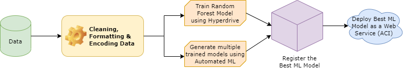
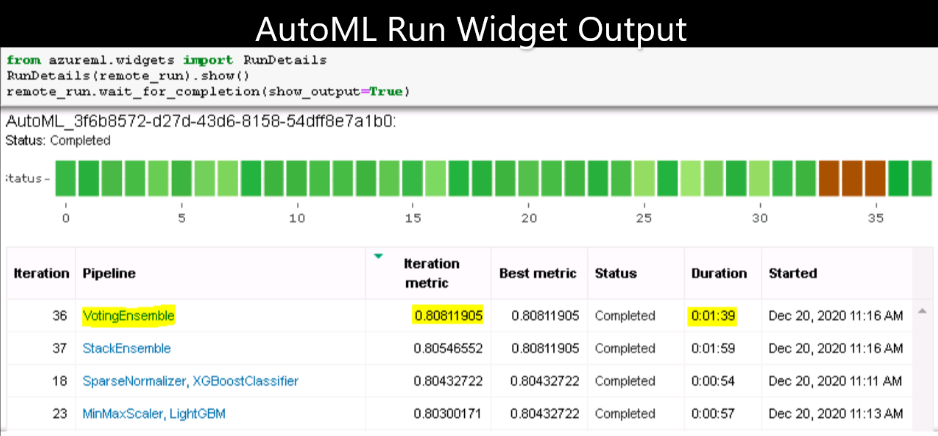
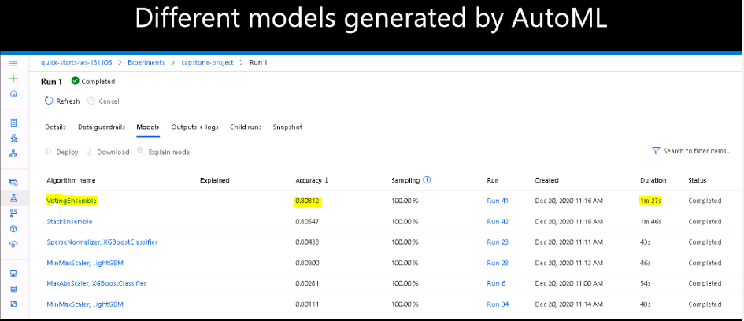
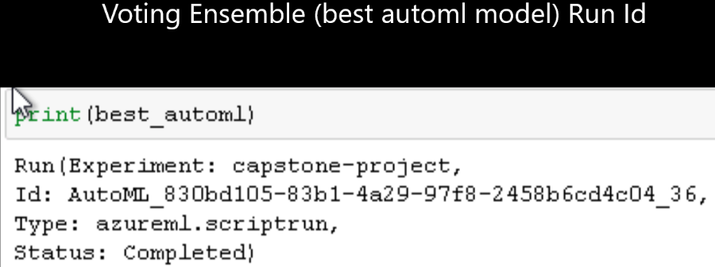
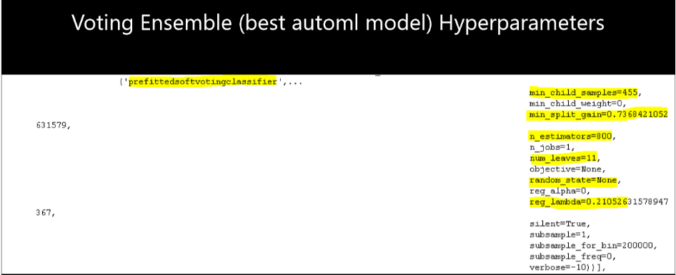
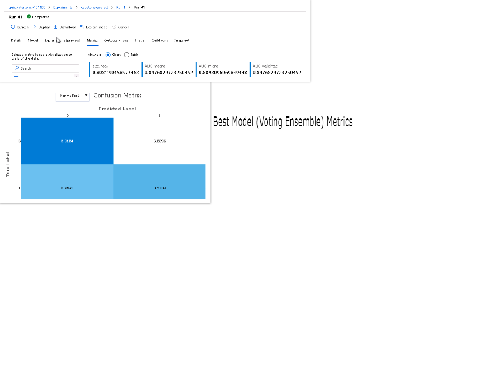
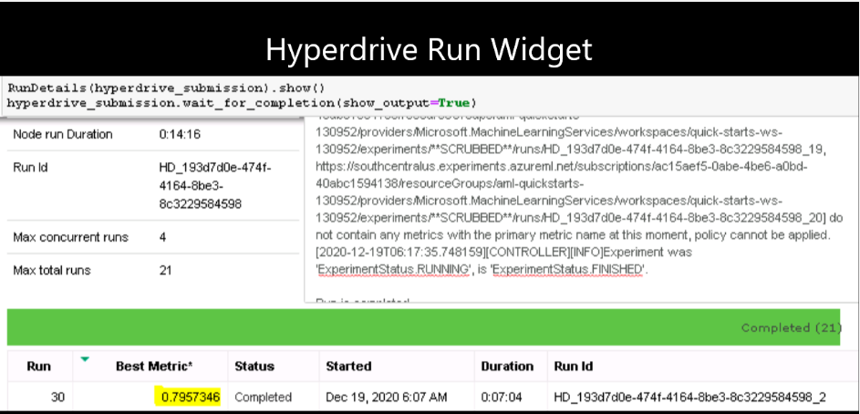
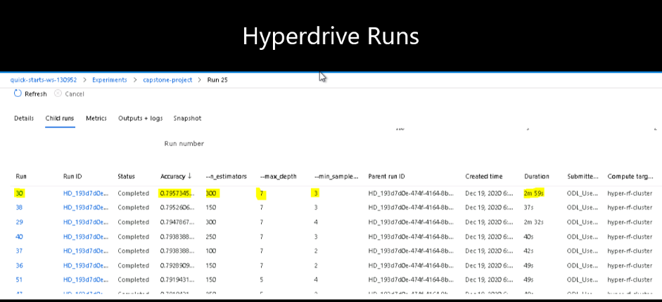
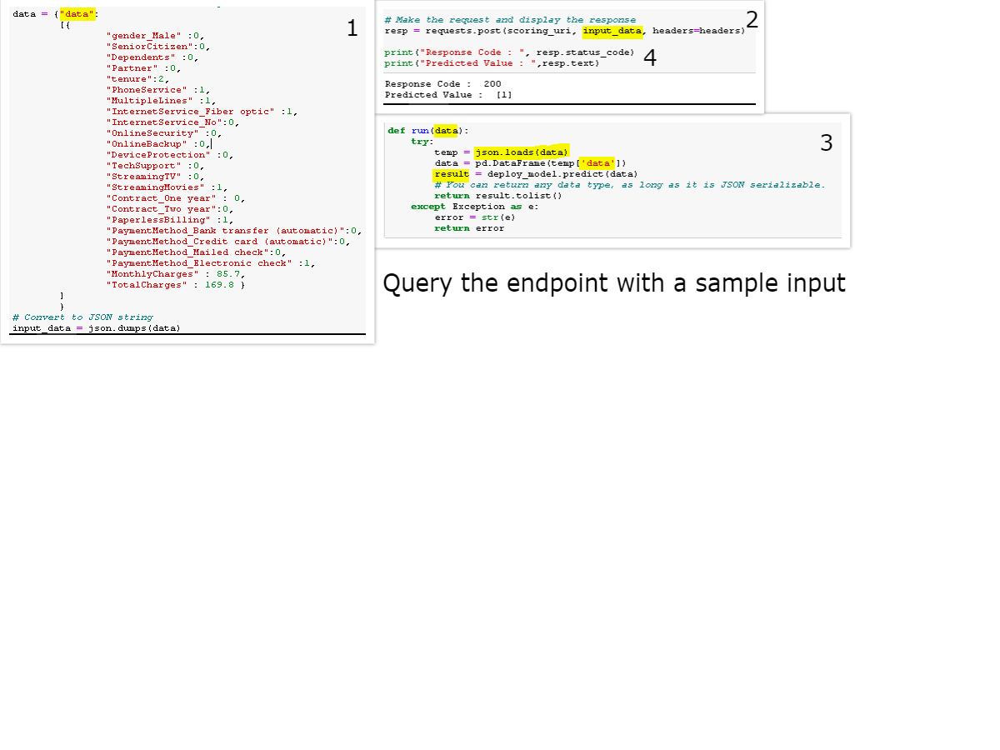
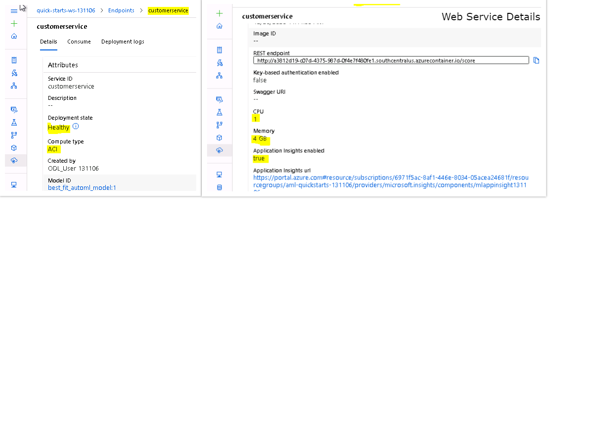

# Predict Customer Churn
The project uses [Telco Customer Churn Dataset](https://www.kaggle.com/blastchar/telco-customer-churn) in azure workspace to train models using the different tools and         features (Hyperdrive and AutoML) available in the AzureML framework and deploy the best machine learning model as a web service using python sdk.

## Project Architecture

## Dataset

### Overview

 Each row represents a customer, each column contains customer’s attributes described on the column Metadata. The data set includes information about:
  <ol>
    <li> Customers who left within the last month – the column is called Churn. </li>
    <li> Services that each customer has signed up for – phone, multiple lines, internet, online security, online backup, device protection, tech support, and streaming TV and                                                            movies. </li>
    <li> Customer account information – how long they’ve been a customer, contract, payment method, paperless billing, monthly charges, and total charges. </li>
    <li> Demographic info about customers – gender and if they have partners and dependents. </li>
  </ol>

### Task

  Customer churn or customer attrition is the phenomenon where customers of a business no longer purchase or interact with the business. The ability to be able to predict that a   certain customer is at a very high risk of churning, while there is still some time to do something significant about it, itself represents a great additional potential         revenue source for any business.
  So, in this task we will be predicting whether a customer will churn or not and if yes, then the concerned team can inquire or further analyse on cutomer behavior and purchase   details.

### Access
The dataset is accessed directly from github using Azure's [TabularDatasetFactory](https://docs.microsoft.com/en-us/python/api/azureml-core/azureml.data.dataset_factory.tabulardatasetfactory?view=azure-ml-py)

## Automated ML

  Some of the automl configuration done for this classification task are:
  <ul>
    <li> primary_metric (accuracy): The metric that Automated Machine Learning will optimize for model selection. </li>
    <li> experiment_timeout_minutes (25): Maximum amount of time in minutes that all iterations combined can take before the experiment terminates. </li>
    <li> max_concurrent_iterations (4): Represents the maximum number of iterations that would be executed in parallel. </li>
    <li> enable_early_stopping (True): Whether to enable early termination if the score is not improving in the short term. </li>
  </ul>

### Results

The below snapshot shows different models generated by automl feature. 

The below snapshot shows different hyperparameters values of voting ensebmble model generated by automl feature. 

The below snapshot shows different metrics of <b>Voting Ensemble model</b> (best automl model). We can see that the accuracy of the best model is approximately <b>81%</b> 

## Hyperparameter Tuning

 The machine learning model I have chosen to go along with hyperdrive is <b>Random Forest</b> model. In random forest, we end up with trees that are not only trained on           different sets of data (thanks to bagging) but also use different features to make decisions.
  Some of the hyperdrive configuration done for this classification task are:
  <ul>
    <li> primary_metric_name (accuracy): The name of the primary metric reported by the experiment runs. </li>
    <li> The parameter sampler I chose is <b>RandomParameterSampling</b> because it supports both discrete and continuous hyperparameters. It supports early termination of low-          performance runs and supports early stopping policies. </li>
    <li> The early stopping policy I chose was <b>BanditPolicy</b> because it is based on slack factor and evaluation interval. Bandit terminates runs where the primary metric            is not within the specified slack factor compared to the best performing run. </li>
    <li> max_concurrent_runs (4): The maximum number of runs to execute concurrently. </li>
    <li> max_total_runs (21): The maximum total number of runs to create. This is the upper bound; there may be fewer runs when the sample space is smaller than this value.         </li>
  </ul>

### Results

The below snapshot shows different runs with different parameters values in hyperparameter search space. 

## Model Deployment

From above two ways (automl and randomforest+hyperdrive), we see that the best ml model was Voting Ensemble model generated by automl. I have registered and deployed this        model as a web service using ACI (Azure Container Instance).The below snapshot shows active web service endpoint that is use to access the deployed machine learning model.
   The sample data feeded to the deployed model as a web service request as shown in the below <i> screen recording </i> is transformed and encoded data.

   

## Screen Recording
<a href="https://youtu.be/Ld2U66pn2ZM"> Working of the deployed model </a>

## Standout Suggestions

In this deployment I have enabled <b>Application Insight</b> which helps in logging and monitoring of web service and its related details.

## Future work
<ul>
  <li> To check or measure the fairness of the models.</li>
  <li> Work on conversion of registered model to ONNX format, allowing one to interchange models between various ML frameworks and tools.</li>
  <li> Deep dive into Azure automl to identify overfitting and imbalanced data and implement best practices to help mitigate them. </li>
</ul>
